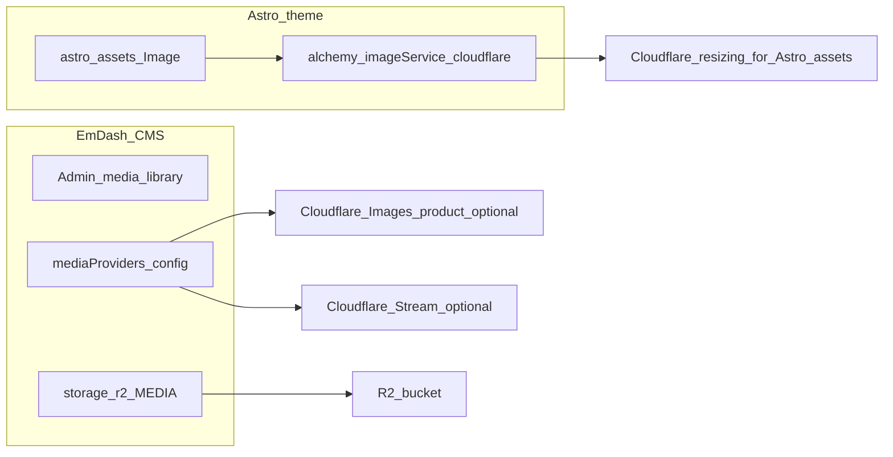

# CMS media (EmDash) vs Astro image optimization

This document clarifies how **EmDash media storage/providers** relate to **Astro’s image pipeline** in this monorepo, and how to run **R2-only CMS media** without the Cloudflare **Images** product while still optimizing **theme** images.

For bindings, Alchemy, and two-D1 rules, see [emdash-cms-integration.md](./emdash-cms-integration.md).

## Two separate layers

| Layer | Config (this repo) | Purpose |
|--------|-------------------|---------|
| **EmDash storage** | `storage: r2({ binding: "MEDIA" })` in [apps/web/astro.config.mjs](../apps/web/astro.config.mjs) | Default CMS uploads and files in **R2**. |
| **EmDash media providers** | Optional `mediaProviders: [ cloudflareImages(...), cloudflareStream(...) ]` | Extra providers backed by **Cloudflare Images** and **Stream** APIs (`imagedelivery.net`, etc.). Not required for R2-only CMS. |
| **Astro images** | `adapter: alchemy({ imageService: "cloudflare", ... })` | **`astro:assets`** (`<Image />`, `getImage()`) for **theme** images (e.g. under `src/`) and authorized remotes. |

The adapter’s **`imageService: "cloudflare"`** is **not** the same as registering EmDash with the **Cloudflare Images** SKU in the dashboard. Name overlap is confusing but the integration points differ.

## Cloudflare Images product vs Workers paid plan

- **Workers (paid)** runs the site worker, bindings (D1, R2, KV, etc.), and features like **Worker Loader** for sandboxed plugins. It does **not** replace a separate **Cloudflare Images** subscription or quota.
- **EmDash core** (admin, D1, **R2** storage) works **without** the Images product if you do not use the `cloudflareImages()` provider.
- If you **do** use `cloudflareImages()`, the account needs the **Images** product enabled; billing follows **Images** plans and free tier, independent of Workers.

## Environment variables and local dev

- **`CF_MEDIA_ACCOUNT_ID`**, **`CF_MEDIA_API_TOKEN`**, **`CF_IMAGES_ACCOUNT_HASH`** are for the **Cloudflare Images** EmDash provider (and related Stream config where applicable).
- **`CF_IMAGES_ACCOUNT_HASH`** is **not** a hash you generate (SHA, etc.). It is the **Images account hash** segment in delivery URLs: `https://imagedelivery.net/<ACCOUNT_HASH>/<IMAGE_ID>/<variant>`. Find it in the Cloudflare dashboard under **Images** (developer resources / delivery URL), not in Workers settings.
- Node loads **`apps/web/.env`** for Alchemy and tooling; the **Worker isolate** during `astro dev` reads **`apps/web/.dev.vars`** (Wrangler/Miniflare). If media vars exist in `.env` but the Worker still errors with “Missing `CF_MEDIA_*`”, add the same keys to **`.dev.vars`**.

See [emdash-cms-integration.md](./emdash-cms-integration.md) (environment table and troubleshooting).

## R2-only CMS + Astro-optimized theme images

**This repository’s [apps/web/astro.config.mjs](../apps/web/astro.config.mjs) is configured this way:** R2 storage only, no `mediaProviders`, adapter **`imageService: "cloudflare"`** unchanged.

**Goal:** No Cloudflare **Images** product for the media library; CMS files stay on **R2**; theme still uses Astro optimization.

1. Keep **`storage: r2({ binding: "MEDIA" })`**.
2. Omit **`mediaProviders`** (or **`mediaProviders: []`**). Do not import **`cloudflareImages`** / **`cloudflareStream`** unless you add those providers back.
3. Keep **`imageService: "cloudflare"`** on the Alchemy adapter.
4. In theme code, use **`import` + `<Image />` / `getImage()`** for local assets. For **remote** CMS URLs, configure Astro **`image`** `domains` / `remotePatterns` if those URLs should go through `astro:assets` ([Astro: authorizing remote images](https://docs.astro.build/en/guides/images/#authorizing-remote-images)).

You can remove unused **`CF_MEDIA_*`** / **`CF_IMAGES_ACCOUNT_HASH`** from `.env` and `.dev.vars` when no provider needs them.

## Using both Images product and Astro assets

They **can work alongside** each other:

- **Images product + EmDash** — editor-managed assets and `imagedelivery.net` (variants, API).
- **Astro `<Image />`** — static/theme images and optionally CMS URLs if remotes are allowed.

They are complementary, not mutually exclusive, unless you choose R2-only for cost or simplicity.

## Related docs

- [emdash-cms-integration.md](./emdash-cms-integration.md) — full integration, `.dev.vars`, sandbox (`LOADER` / `PluginBridge`).
- [emdash-cms-setup.md](./emdash-cms-setup.md) — short setup steps.
- [r2-cms-media-vs-cloudflare-images.md](./r2-cms-media-vs-cloudflare-images.md) — R2 + EmDash image fields vs Cloudflare Images product (aerial / CMS media).
