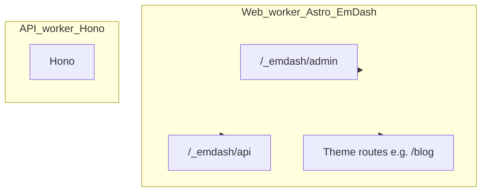

# EmDash CMS integration report

This document describes how EmDash CMS is integrated in **tehs-aerial-images**, so you can reproduce or refresh the setup later. It assumes the **Better-T-Stack** layout: `apps/web` (Astro), `apps/server` (Hono), `packages/infra` (Alchemy), `packages/db` (Drizzle).

## 1. Goals and constraints

- **EmDash** runs inside the **Astro** app on Cloudflare Workers (`apps/web`), using the **`alchemy/cloudflare/astro`** adapter (a thin wrapper over `@astrojs/cloudflare`).
- **Hono + Drizzle** keep a **separate D1** for API data (`packages/db` migrations). EmDash uses **its own D1** and **Kysely** internally; do not merge migration directories.
- **Bindings** must match between Alchemy (deploy + local Wrangler) and `astro.config.mjs` (`d1({ binding: "DB" })`, `r2({ binding: "MEDIA" })`, etc.).

Official references:

- [EmDash on GitHub](https://github.com/emdash-cms/emdash)
- [EmDash Cloudflare demo `astro.config.mjs`](https://github.com/emdash-cms/emdash/blob/main/demos/cloudflare/astro.config.mjs) (pattern reference; this repo uses `alchemy()` instead of raw `cloudflare()`)

## 2. Architecture (high level)



**Bindings (summary):** Web worker: `DB` (EmDash D1), `MEDIA` (R2), `SESSION` (KV), optional `LOADER` (sandboxed plugins); flags `nodejs_compat`, `disable_nodejs_process_v2`. API worker: `DB` (Drizzle D1), `R2`.

## 3. Dependencies (`apps/web`)

Install from **`apps/web`** with pnpm (monorepo convention):

| Package | Role |
|--------|------|
| `emdash`, `emdash/astro` | CMS integration |
| `@emdash-cms/cloudflare` | `d1()`, `r2()`, `sandbox()`, `access()`, `cloudflareImages()`, `cloudflareStream()` |
| `@astrojs/react`, `react`, `react-dom` | EmDash peer dependencies |
| `@tanstack/react-query`, `@tanstack/react-router` | EmDash peer dependencies |
| `kysely` | Peer of `@emdash-cms/cloudflare` |
| `@emdash-cms/plugin-forms`, `@emdash-cms/plugin-webhook-notifier` | Optional first-party plugins (demo parity) |
| `@phosphor-icons/react`, `@cloudflare/kumo` | Peers of `@emdash-cms/plugin-forms` |
| `astro-portabletext` | Rendering Portable Text on theme pages (e.g. blog post body) |

Use **`@astrojs/react` v5+** with **Astro 6** to satisfy EmDash’s peer range.

**`package.json` extras:**

- `"emdash": { "seed": "seed/seed.json" }` — default collections/content seed path.
- Script: `"emdash:types": "emdash types"` — regenerate collection typings when the live schema changes (requires a running dev server and reachable admin in practice).

## 4. Alchemy (`packages/infra/alchemy.run.ts`)

### 4.1 Second D1 for EmDash

Keep the existing Drizzle database:

```ts
const db = await D1Database("database", {
  migrationsDir: "../../packages/db/src/migrations",
});
```

Add a **second** database **without** Drizzle migrations (EmDash owns schema):

```ts
const emdashDb = await D1Database("emdash-database");
```

### 4.2 R2 and KV

- Reuse the same **`R2Bucket("r2")`** for both workers if you want one bucket: bind it as **`MEDIA`** on the web worker (EmDash expects that binding name) and keep **`R2`** (or your name) on the API worker.
- Create a **KV namespace** for Astro’s session driver (default binding name **`SESSION`**):

```ts
const sessionKv = await KVNamespace("emdash-sessions");
```

`@astrojs/cloudflare` enables the KV session driver and expects the **`SESSION`** binding unless you customize it.

### 4.3 Web worker bindings

On **`Astro("web", { ... })`**:

- `compatibilityFlags: ["nodejs_compat", "disable_nodejs_process_v2"]` — required for EmDash / Astro SSR on workerd (aligns with EmDash Cloudflare demo).
- `bindings`:
  - `PUBLIC_SERVER_URL` — from `alchemy.env` (or your env story).
  - `DB: emdashDb` — EmDash D1.
  - `MEDIA: r2` — same bucket resource, **binding name** `MEDIA`.
  - `SESSION: sessionKv`.
  - `LOADER: WorkerLoader()` — only if you use **sandboxed** EmDash plugins (`sandbox()` + `sandboxed: [...]`). See §8 (paid plan).

Do **not** point the web worker’s `DB` at the Drizzle D1.

## 5. Astro config (`apps/web/astro.config.mjs`)

### 5.1 Adapter: Alchemy + `configPath` (critical for local dev)

Use:

```ts
import alchemy from "alchemy/cloudflare/astro";
import path from "node:path";
import { fileURLToPath } from "node:url";

const __dirname = path.dirname(fileURLToPath(import.meta.url));
const alchemyWranglerPath = path.join(__dirname, ".alchemy/local/wrangler.jsonc");

export default defineConfig({
  adapter: alchemy({
    imageService: "cloudflare",
    configPath: alchemyWranglerPath,
  }),
  // ...
});
```

**Why `configPath` is required:** `@astrojs/cloudflare` passes options into `@cloudflare/vite-plugin` as `cfVitePlugin({ ...userOptions, ...cfPluginConfig })`. Astro’s internal `cfPluginConfig` includes a `config` callback that **overrides** any inline `config` you might set. The **compat flags** (`nodejs_compat`, etc.) therefore must come from the **Wrangler file** Alchemy generates. If Vite does not load that file, local dev can fail with **`Failed to load url node:module`** in the SSR runner. Pointing `configPath` at **the same** `apps/web/.alchemy/local/wrangler.jsonc` that Alchemy’s `platformProxy` validates fixes that.

`astro.config.mjs` runs in **Node** at CLI time; using `node:path` / `node:url` here is normal and does not run on the Worker.

### 5.2 Integrations order

1. **`react()`** — before EmDash.
2. **`emdash({ ... })`** — database, storage, auth, media, plugins.

Example shape (match binding names to Alchemy):

```ts
import emdash from "emdash/astro";
import {
  d1,
  r2,
  access,
  sandbox,
  cloudflareImages,
  cloudflareStream,
} from "@emdash-cms/cloudflare";
import { formsPlugin } from "@emdash-cms/plugin-forms";
import { webhookNotifierPlugin } from "@emdash-cms/plugin-webhook-notifier";

emdash({
  database: d1({ binding: "DB", session: "disabled" }), // or "auto" if D1 sessions/replication configured
  storage: r2({ binding: "MEDIA" }),
  ...(emdashAuth ? { auth: emdashAuth } : {}),
  mediaProviders: [
    cloudflareImages({
      accountIdEnvVar: "CF_MEDIA_ACCOUNT_ID",
      apiTokenEnvVar: "CF_MEDIA_API_TOKEN",
      accountHashEnvVar: "CF_IMAGES_ACCOUNT_HASH",
    }),
    cloudflareStream({
      accountIdEnvVar: "CF_MEDIA_ACCOUNT_ID",
      apiTokenEnvVar: "CF_MEDIA_API_TOKEN",
    }),
  ],
  plugins: [formsPlugin()],
  sandboxed: [webhookNotifierPlugin()],
  sandboxRunner: sandbox(),
  marketplace: "https://marketplace.emdashcms.com",
}),
```

**Cloudflare Access (optional):** if `process.env.CF_ACCESS_TEAM_DOMAIN` is set, configure `auth: access({ teamDomain, audienceEnvVar: "CF_ACCESS_AUDIENCE", ... })`. When Access is enabled, passkey admin behavior is replaced per EmDash docs.

### 5.3 Clean Vite plugins

In a minimal setup, `vite.plugins` should include **`tailwindcss()`** (if you use Tailwind) only. Remove any **temporary** dev-only middleware (e.g. logging `/_astro` responses) before treating the integration as final.

## 6. Theme / content consumption

- **Admin:** `/_emdash/admin`
- **Query API:** `getEmDashCollection`, `getEmDashEntry` from `emdash` in `.astro` frontmatter (see [EmDash README](https://github.com/emdash-cms/emdash)).
- **Portable Text:** render with `astro-portabletext` (e.g. import `PortableText.astro` from the package).
- **Seed:** `apps/web/seed/seed.json` (or your path) referenced from `package.json` → `"emdash": { "seed": "..." }`.
- **Types:** `apps/web/emdash-env.d.ts` augments `emdash` collection types; regenerate with `pnpm --filter web emdash:types` when the schema changes, or maintain by hand if CLI cannot reach the instance.

Avoid Astro routes under `/_emdash/*`.

## 7. Environment variables and where to set them

| Variable | Purpose |
|----------|---------|
| `CF_ACCESS_TEAM_DOMAIN` | Read at **astro config** time; enables Access auth when set. |
| `CF_ACCESS_AUDIENCE` | Worker runtime; Access audience (see `audienceEnvVar`). |
| `CF_MEDIA_ACCOUNT_ID`, `CF_MEDIA_API_TOKEN`, `CF_IMAGES_ACCOUNT_HASH` | Cloudflare Images / Stream providers in EmDash. |

**Local development:**

- **`apps/web/.env`** — loaded by `packages/infra/alchemy.run.ts` (`dotenv`); good for `CF_ACCESS_TEAM_DOMAIN` and general web vars. Document templates in **`apps/web/.env.example`**.
- **`apps/web/.dev.vars`** — Wrangler/Miniflare convention for vars/secrets visible to the **Worker** at runtime. Use when values are missing inside the isolate (e.g. media env) even though `.env` exists.
- **`packages/infra/.env`** — optional; loaded first by infra.

**Production:** bind secrets/vars on the **web** worker via Alchemy/Cloudflare (not committed files).

`PUBLIC_SERVER_URL` remains a normal public var for the web app (Alchemy binding + Astro `env` schema as in this repo).

## 8. Paid Cloudflare Workers considerations

- **Dynamic Workers / Worker Loader** (`LOADER` binding + `sandbox()` + `sandboxed` plugins): EmDash documents these as requiring a **paid** Workers capability. To stay off that path, remove **`WorkerLoader()`** from web bindings, and drop **`sandboxRunner`** / **`sandboxed`** (and related plugins) from `emdash({ ... })`.
- **`nodejs_compat`** is not the same as Dynamic Workers; it is normal for this stack on Workers.

## 9. Verification checklist

1. `pnpm install`
2. `pnpm run dev` (runs Alchemy + Astro + API) — ensure `apps/web/.alchemy/local/wrangler.jsonc` exists after Alchemy runs.
3. Open `http://localhost:4321/_emdash/admin` — complete setup / passkey (or Access).
4. Open themed routes (e.g. `/blog`) if you added `getEmDashCollection` pages.
5. `pnpm run build` (or `pnpm --filter web build`) — should complete; expect warnings if media env or sandbox bindings are missing.
6. Confirm API worker still uses **`DB`** = Drizzle D1 only.

## 10. Troubleshooting

| Symptom | Likely cause |
|---------|----------------|
| `Failed to load url node:module` in Vite dev | SSR worker not loading Wrangler compat flags; set **`configPath`** to `apps/web/.alchemy/local/wrangler.jsonc` on the `alchemy()` adapter (§5.1). |
| `Content config not loaded` | Astro content layer message; EmDash uses live collections — often benign if admin works. |
| Missing `CF_MEDIA_*` / Stream warnings | Vars not in Worker env; use **`.dev.vars`** or Alchemy bindings. |
| `emdash types` / typegen fetch errors | Admin not reachable, CSRF, or dev not running; use hand-maintained `emdash-env.d.ts` or fix network/session. |
| Sandbox / LOADER errors on free tier | Remove Worker Loader + sandboxed plugins (§8). |

## 11. Cursor / repo conventions

- **`.cursor/rules/emdash.mdc`** — admin path `/_emdash/admin`, Kysely vs Drizzle split, typegen note, globs for pages/seed/env typings.

## 12. File index (this integration)

| Path | Role |
|------|------|
| [apps/web/astro.config.mjs](../apps/web/astro.config.mjs) | Alchemy adapter + `configPath`, React, EmDash |
| [packages/infra/alchemy.run.ts](../packages/infra/alchemy.run.ts) | EmDash D1, R2 as `MEDIA`, `SESSION` KV, `LOADER`, flags |
| [apps/web/package.json](../apps/web/package.json) | Dependencies, `emdash.seed`, `emdash:types` |
| [apps/web/.env.example](../apps/web/.env.example) | Documented optional CF vars |
| [apps/web/seed/seed.json](../apps/web/seed/seed.json) | Default blog-style seed (if present) |
| [apps/web/emdash-env.d.ts](../apps/web/emdash-env.d.ts) | `EmDashCollections` augmentation |
| [apps/web/src/pages/blog/](../apps/web/src/pages/blog/) | Example listing + `[slug]` pages |
| [.cursor/rules/emdash.mdc](../.cursor/rules/emdash.mdc) | Agent/project rules |

---

*Last updated to match repo layout and EmDash 0.1.x / `@emdash-cms/cloudflare` 0.1.x patterns.*
