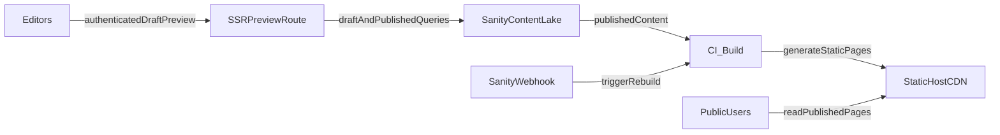

# Sanity SSG + SSR Preview Plan

## Goal

Move location content to Sanity while preserving fast public performance:
static generation for published pages and authenticated server-rendered
preview for draft/editor workflows.

## Current Baseline (from code)

- Data source is local in [`/workspaces/tehs-aerial-images/apps/web/src/lib/locations.ts`](/workspaces/tehs-aerial-images/apps/web/src/lib/locations.ts).
- Homepage map consumes `locations` directly in [`/workspaces/tehs-aerial-images/apps/web/src/components/aerial-map.tsx`](/workspaces/tehs-aerial-images/apps/web/src/components/aerial-map.tsx).
- Marker/details UI assumes `photos[0]` exists in [`/workspaces/tehs-aerial-images/apps/web/src/components/aerial-map-marker.tsx`](/workspaces/tehs-aerial-images/apps/web/src/components/aerial-map-marker.tsx).
- Dynamic route is currently SSG from local data using `getStaticPaths()` in [`/workspaces/tehs-aerial-images/apps/web/src/pages/locations/[slug].astro`](/workspaces/tehs-aerial-images/apps/web/src/pages/locations/[slug].astro).

## Target Architecture

## How Astro Works with Sanity

- Astro can consume Sanity in two main modes:
  - SSG mode: run GROQ queries at build time (for `getStaticPaths()` and
    page data), emit static HTML, serve via CDN.
  - SSR mode: run GROQ queries per request on the server runtime, enabling
    draft/live preview without rebuild.
- For this project:
  - Public homepage + location pages remain SSG and only use published
    documents.
  - Preview routes use SSR and read draft-aware content with authenticated
    access.
- Sanity query behavior should be split by intent:
  - published/public: `useCdn: true` with minimal fields per page context.
  - preview/draft: non-CDN or draft-aware queries for freshness and
    editorial accuracy.

## Implementation Plan

### 1) Introduce a Sanity data access layer with strict runtime validation

- Add a dedicated data module for fetching and mapping location content from
  Sanity.
- Keep app-facing types aligned with existing `LocationRecord`/`LocationPhoto`
  shape to minimize component churn.
- Add runtime validation (e.g., Zod) to protect against malformed CMS payloads
  and enforce required fields.
- Add safe fallbacks for optional/empty fields (especially photos and
  metadata).

### 2) Keep public pages SSG (high-performance default)

- Update homepage data loading and `locations/[slug]` static path generation to
  source from Sanity published content at build time.
- Continue using static generation for all public routes so cacheable HTML is
  served from CDN.
- Ensure map/list views request only fields needed for that surface:
  - list/map: `slug`, `name`, `coordinates`, `shortDescription`, first image +
    minimal photo metadata
  - detail page: full description + full photo metadata set

### 3) Add authenticated SSR preview flow for editors/drafts

- Create preview-only route(s) rendered server-side to fetch draft-aware
  Sanity content.
- Gate preview via secret/token-based auth check; deny anonymous access.
- Ensure preview routes are noindex and isolated from public
  indexing/navigation.
- Preserve public route behavior: drafts never leak into public SSG output.

### 4) Configure Sanity query strategy for speed and cost

- Use Sanity CDN for published content (`useCdn: true`) in all public/build-time
  fetches.
- Use non-CDN/live behavior only where draft freshness is required (preview
  routes).
- Split GROQ query shapes per page context to avoid over-fetching large image
  arrays on list/map surfaces.

### 5) Wire webhook-triggered rebuilds

- Configure Sanity webhook to trigger CI/CD build on publish/unpublish of
  location documents.
- Validate webhook secret and log trigger outcomes.
- Document expected propagation timeline: publish -> webhook -> build -> CDN
  invalidation.

### 6) Harden UI against CMS edge cases

- Update marker/detail rendering paths to handle:
  - zero-photo locations (placeholder/fallback behavior),
  - malformed/empty `photoDate`,
  - missing optional text fields (`caption`, `comments`).
- Keep graceful "not found" behavior for unknown slugs.

### 7) Observability and rollout safety

- Add lightweight logging around CMS fetch failures and schema validation
  failures.
- Keep local mock dataset behind a temporary fallback/dev flag during migration.
- Roll out in phases: adapter + SSG switch first, preview/auth second, webhook
  automation third.

### 8) Account for Cloudflare Workers hosting differences

- Decide output/runtime mode explicitly per environment:
  - SSG-only deployment: Astro build output is static assets; Sanity is queried
    only during CI build.
  - Workers SSR/hybrid deployment: Astro server output runs in Cloudflare
    Workers; Sanity can be queried at request time for preview (and any opted-in
    SSR routes).
- Keep public performance behavior consistent:
  - still prefer SSG for public location pages even when Workers is enabled,
  - reserve Workers SSR for preview/editor-only paths.
- Align caching strategy with runtime:
  - static assets/pages cached at edge by default,
  - SSR preview responses sent with restrictive cache headers to prevent draft
    caching leaks.
- Align secrets/auth with Workers:
  - store preview tokens/webhook secrets as Workers environment bindings,
  - validate secrets in webhook and preview endpoints without exposing them
    client-side.
- Validate that all server code stays edge-compatible (no Node-only APIs) for
  Workers runtime.

## Validation Plan

- Build test: verify public pages still pre-render and output expected static
  routes.
- Preview test: verify draft updates appear without rebuild and are
  auth-protected.
- Data integrity test: intentionally break/miss fields in CMS and confirm UI
  degrades safely.
- Performance check: compare map/list payload size before/after query scoping.
- Hosting parity test: verify behavior differences between local dev, static
  build, and Workers SSR preview are intentional and documented.

## Risks and Mitigations

- Missing/invalid CMS fields can break UI -> runtime schema validation +
  defaults.
- Rebuild lag after publish -> set clear editorial SLA and monitor
  webhook/build failures.
- Draft leakage into public pages -> isolate preview token flow and keep public
  SSG on published dataset only.
- Environment mismatch (static vs Workers SSR expectations) -> document
  route-by-route rendering mode and enforce via deployment checks.

## Deliverables

- Sanity-backed location data adapter and query modules.
- Updated SSG page data loading for index + location slug routes.
- Authenticated SSR preview route(s) for editors.
- Webhook and deployment documentation.
- Migration note in progress docs summarizing behavior, validation, and
  operational flow.
- Hosting decision note describing Astro+Sanity behavior on static hosting
  versus Cloudflare Workers.
